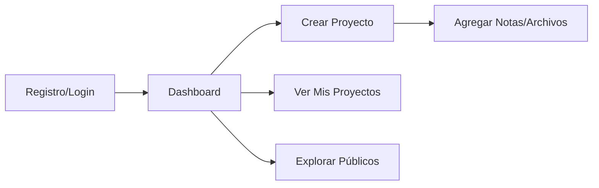
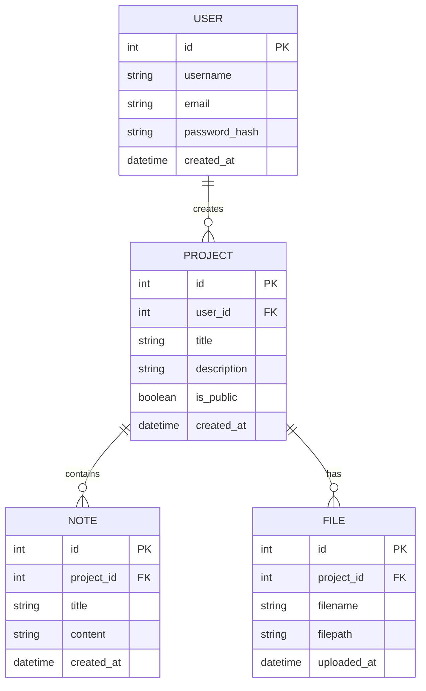

<div align="center">

# 📚 Project Hub

### Plataforma de Gestión de Proyectos Académicos

[](https://www.python.org/) [](https://flask.palletsprojects.com/) [](https://www.sqlite.org/) [](./LICENSE)

*Una solución centralizada y sencilla para gestionar proyectos, notas y archivos académicos*

[Características](#-características) • [Instalación](#-instalación) • [Uso](#-uso) • [Documentación](#-documentación-técnica)

</div>

---

## 📋 Descripción

**Project Hub** es una plataforma web diseñada específicamente para entornos universitarios, que permite a los estudiantes gestionar sus proyectos académicos de manera eficiente y organizada. Con una interfaz intuitiva y funcionalidades completas de CRUD, los usuarios pueden crear proyectos, tomar notas, subir archivos y colaborar compartiendo proyectos públicos.

### 🎯 Objetivo

Centralizar la gestión de proyectos académicos en una única plataforma, facilitando la organización, colaboración y seguimiento de trabajos universitarios.

---

## 🎬 Demo

> [!NOTE]
> *Proyecto en desarrollo - Capturas de pantalla próximamente*

<!-- Aquí puedes agregar un GIF o screenshot cuando tengas la aplicación funcionando:

-->

---

## ✨ Características

### 👤 Gestión de Usuarios
- ✅ Registro de nuevos usuarios
- ✅ Inicio de sesión seguro
- ✅ Cierre de sesión
- ✅ Perfiles de usuario personalizados

### 📁 Gestión de Proyectos
- ✅ **CRUD completo** (Crear, Leer, Actualizar, Eliminar)
- ✅ Proyectos **públicos** o **privados**
- ✅ Dashboard personalizado con vista de proyectos propios
- ✅ Exploración de proyectos públicos de otros usuarios

### 📝 Sistema de Notas
- ✅ Crear notas asociadas a cada proyecto
- ✅ Editar y eliminar notas
- ✅ Organización por proyecto

### 📎 Gestión de Archivos
- ✅ Subir archivos a proyectos
- ✅ Descargar archivos
- ✅ Eliminar archivos
- ✅ Almacenamiento organizado por proyecto

---

## 🛠️ Tecnologías

<table>
<tr>
<td align="center" width="33%">

### Backend
 

Servidor web robusto y ligero

</td>
<td align="center" width="33%">

### Base de Datos


Base de datos relacional embebida

</td>
<td align="center" width="33%">

### Frontend
 

Diseño semántico y responsive

</td>
</tr>
</table>

---

## 🚀 Instalación

### Prerrequisitos

- Python 3.8 o superior
- pip (gestor de paquetes de Python)
- Git

### Pasos de Instalación

#### 1️⃣ Clonar el Repositorio

```bash
git clone https://github.com/tu-usuario/project-hub.git
cd project-hub
```

#### 2️⃣ Crear Entorno Virtual

**Linux / macOS:**
```bash
python -m venv venv
source venv/bin/activate
```

**Windows:**
```bash
python -m venv venv
venv\Scripts\activate
```

#### 3️⃣ Instalar Dependencias

```bash
pip install -r requirements.txt
```

#### 4️⃣ Ejecutar la Aplicación

```bash
python app.py
```

#### 5️⃣ Acceder a la Aplicación

Abre tu navegador y visita:
```
http://127.0.0.1:5000
```

> [!TIP]
> Si encuentras problemas con el puerto 5000, puedes modificar el puerto en `app.py` cambiando el parámetro `port` en `app.run()`.

---

## 📂 Estructura del Proyecto

```
project-hub/
│
├── 📁 static/                    # Archivos estáticos
│   ├── 📁 css/
│   │   └── styles.css           # Estilos CSS principales
│   ├── 📁 js/
│   │   └── scripts.js           # Scripts JavaScript
│   └── 📁 uploads/              # Archivos subidos por usuarios
│
├── 📁 templates/                 # Plantillas HTML
│   └── base.html                # Plantilla base
│
├── .gitignore                   # Archivos ignorados por Git
├── LICENSE                      # Licencia del proyecto
├── README.md                    # Este archivo
├── app.py                       # Aplicación principal Flask
├── models.py                    # Modelos de base de datos
└── requirements.txt             # Dependencias del proyecto
```

### 📄 Descripción de Archivos Principales

| Archivo | Descripción |
|---------|-------------|
| `app.py` | Punto de entrada de la aplicación Flask. Contiene las rutas y lógica del servidor |
| `models.py` | Define los modelos de datos y funciones de base de datos usando SQLite3 |
| `requirements.txt` | Dependencias de Python necesarias para el proyecto |
| `static/` | Recursos estáticos (CSS, JavaScript, archivos subidos) |
| `templates/` | Plantillas HTML renderizadas por Flask |

---

## 💡 Uso

### Flujo de Trabajo Típico



### 📖 Guía Paso a Paso

1. **Registro e Inicio de Sesión**
   - Accede a la página principal
   - Regístrate con tus credenciales o inicia sesión si ya tienes cuenta

2. **Dashboard**
   - Visualiza todos tus proyectos en un solo lugar
   - Accede rápidamente a proyectos recientes

3. **Crear un Proyecto**
   - Haz clic en "Nuevo Proyecto"
   - Completa la información del proyecto
   - Define si será **público** (visible para todos) o **privado** (solo para ti)

4. **Gestionar Proyecto**
   - **Notas:** Agrega notas para documentar avances, ideas o recordatorios
   - **Archivos:** Sube documentos, imágenes, código fuente, etc.
   - **Editar:** Modifica la información del proyecto en cualquier momento
   - **Eliminar:** Borra proyectos que ya no necesites

5. **Explorar Proyectos Públicos**
   - Descubre proyectos de otros estudiantes
   - Inspírate con trabajos de la comunidad
   - Modo solo lectura para respetar la autoría

---

## 📚 Documentación Técnica

### Arquitectura

**Project Hub** sigue el patrón **MVC (Model-View-Controller)**:

- **Model** (`models.py`): Define la estructura de datos y funciones de base de datos usando SQLite3
- **View** (`templates/`): Plantillas HTML que renderizan la interfaz de usuario
- **Controller** (`app.py`): Rutas Flask que manejan la lógica de negocio

### Base de Datos

#### Esquema de Datos



### API Endpoints

| Método | Ruta | Descripción |
|--------|------|-------------|
| `GET` | `/` | Página principal |
| `GET/POST` | `/register` | Registro de usuario |
| `GET/POST` | `/login` | Inicio de sesión |
| `GET` | `/logout` | Cierre de sesión |
| `GET` | `/dashboard` | Dashboard del usuario |
| `GET/POST` | `/project/new` | Crear nuevo proyecto |
| `GET` | `/project/<id>` | Ver proyecto |
| `POST` | `/project/<id>/edit` | Editar proyecto |
| `POST` | `/project/<id>/delete` | Eliminar proyecto |
| `POST` | `/project/<id>/note` | Agregar nota |
| `POST` | `/project/<id>/upload` | Subir archivo |

---

## 🤝 Contribuciones

Las contribuciones son bienvenidas. Para contribuir:

1. Fork el proyecto
2. Crea una rama para tu feature (`git checkout -b feature/AmazingFeature`)
3. Commit tus cambios (`git commit -m 'Add some AmazingFeature'`)
4. Push a la rama (`git push origin feature/AmazingFeature`)
5. Abre un Pull Request

---

## 📄 Licencia

Este proyecto está bajo la Licencia MIT. Consulta el archivo [LICENSE](./LICENSE) para más detalles.

---

<div align="center">

**Hecho con ❤️ para estudiantes universitarios**

</div>