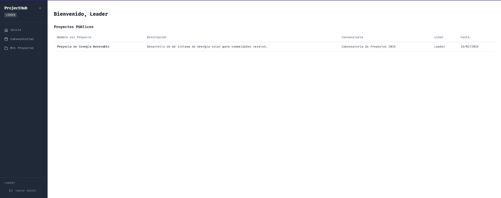
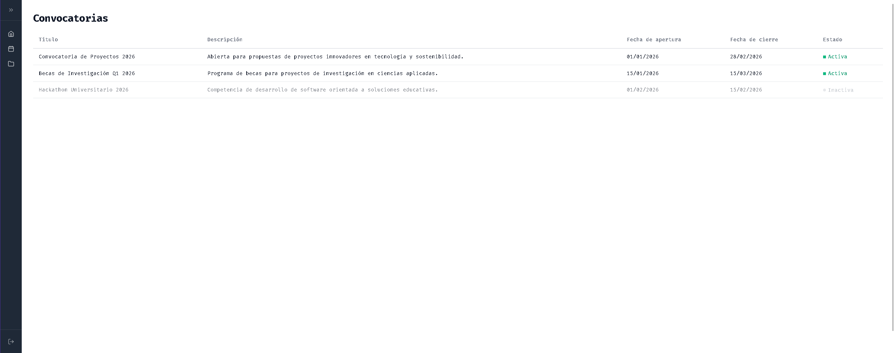
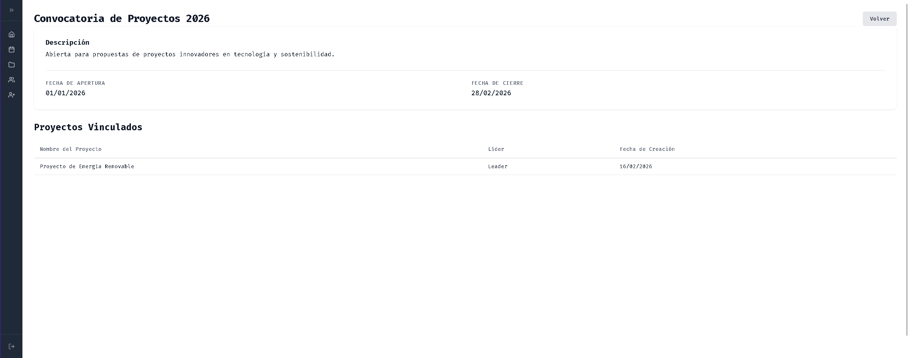
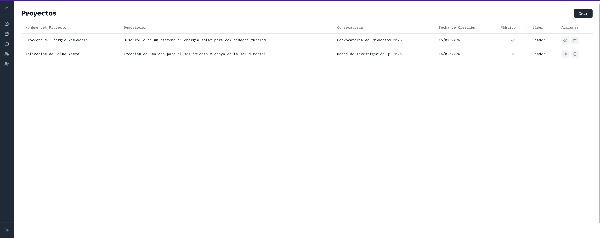
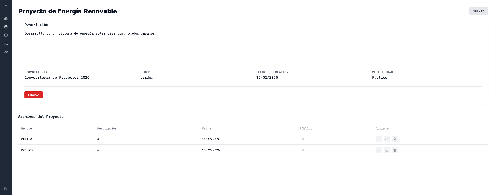
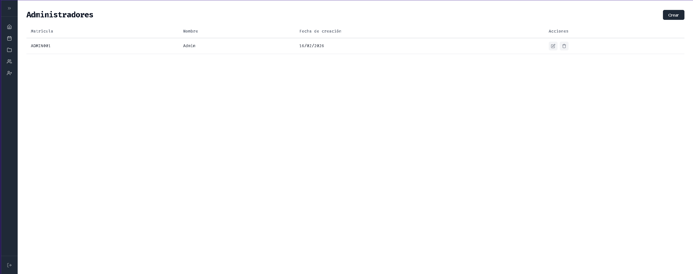
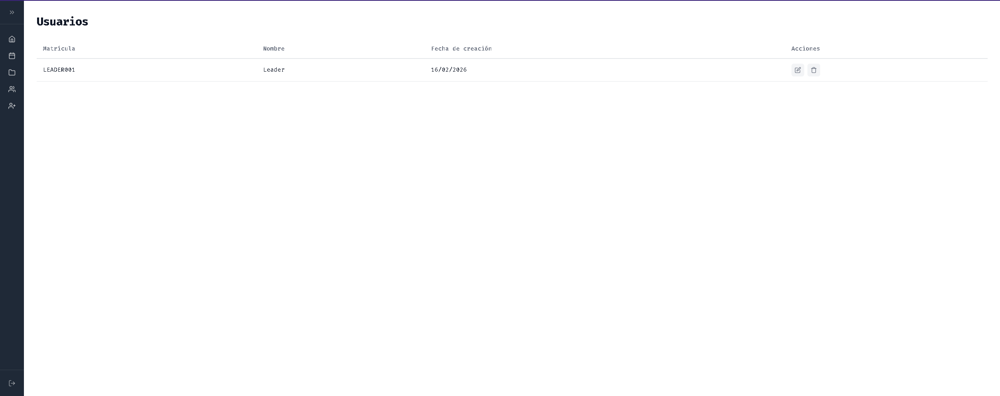
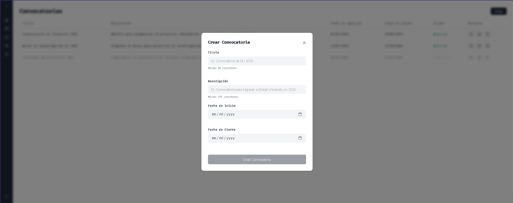
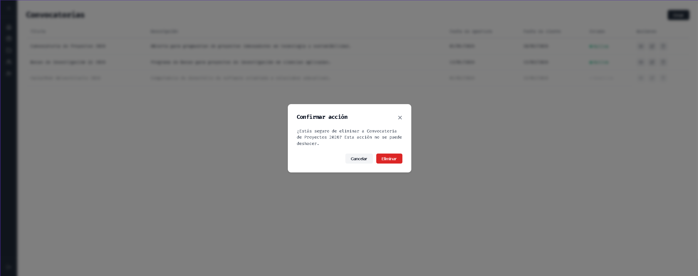

<div align="center">

# Project Hub

### Plataforma de Gestion de Proyectos Academicos

[](https://www.python.org/) [](https://flask.palletsprojects.com/) [](https://www.sqlite.org/) [](./LICENSE)

*Organiza tus proyectos universitarios, sube archivos y colabora con otros estudiantes desde un solo lugar.*

</div>

---

## Capturas de pantalla

### Autenticacion

| Login | Registro |
|:-----:|:--------:|
|  |  |

### Pagina de inicio



### Convocatorias

| Listado de convocatorias | Detalle de convocatoria |
|:------------------------:|:-----------------------:|
|  |  |

### Proyectos

| Listado de proyectos | Detalle de proyecto |
|:--------------------:|:-------------------:|
|  |  |

### Gestion de usuarios (Admin / Owner)

| Administradores | Lideres |
|:---------------:|:-------:|
|  |  |

### Modales

| Crear / Editar | Confirmar eliminacion |
|:--------------:|:---------------------:|
|  |  |

---

## Que es Project Hub?

**Project Hub** es una aplicacion web pensada para universidades donde estudiantes, administradores y coordinadores pueden gestionar proyectos academicos vinculados a convocatorias. Permite subir archivos, controlar quien ve cada proyecto y administrar usuarios segun su rol.

---

## Que puedes hacer?

### Como Lider (Estudiante)
- Registrarte e iniciar sesion con tu numero de matricula
- Crear proyectos dentro de convocatorias activas
- Subir archivos (PDF, Word, imagenes) a tus proyectos
- Decidir si tu proyecto y archivos son publicos o privados
- Explorar proyectos publicos de otros estudiantes

### Como Administrador
- Gestionar convocatorias (crear, editar, eliminar)
- Ver todos los proyectos y archivos del sistema
- Administrar cuentas de los lideres

### Como Owner (Coordinador)
- Todo lo anterior, mas gestionar cuentas de administradores

---

## Como instalar

### Necesitas tener
- Python 3.8 o superior
- pip (viene incluido con Python)
- Git

### Pasos

**1. Clonar el repositorio**
```bash
git clone https://github.com/tu-usuario/project-hub.git
cd project-hub
```

**2. Crear entorno virtual**

Linux / macOS:
```bash
python -m venv venv
source venv/bin/activate
```

Windows:
```bash
python -m venv venv
venv\Scripts\activate
```

**3. Instalar dependencias**
```bash
pip install -r requirements.txt
```

**4. Ejecutar la aplicacion**
```bash
python index.py
```

**5. Abrir en el navegador**
```
http://127.0.0.1:5000
```

> Si el puerto 5000 esta ocupado, puedes cambiar el puerto en `index.py`.

---

## Como funciona

```
Registrarte --> Iniciar sesion --> Ver convocatorias --> Crear proyecto --> Subir archivos
```

1. **Registrate** con tu numero de matricula y un nombre
2. **Inicia sesion** para acceder al panel principal
3. **Explora las convocatorias** activas disponibles
4. **Crea un proyecto** asociado a una convocatoria
5. **Sube archivos** (PDF, DOC, imagenes) a tu proyecto
6. **Controla la visibilidad**: decide quien puede ver tu trabajo

---

## Roles del sistema

| Rol | Que puede hacer |
|-----|-----------------|
| **Leader** | Crear proyectos, subir archivos, ver proyectos publicos |
| **Admin** | Todo lo de Leader + gestionar convocatorias y usuarios |
| **Owner** | Todo lo de Admin + gestionar administradores |

---

## Tipos de archivos permitidos

- PDF (.pdf)
- Word (.doc, .docx)
- Imagenes (.png, .jpg, .jpeg)
- Peso maximo: 10 MB por archivo

---

## Documentacion tecnica

Para informacion detallada sobre la arquitectura, rutas, base de datos y estructura del codigo, consulta el documento [TECHNICAL.md](./TECHNICAL.md).

---

## Licencia

Este proyecto esta bajo la Licencia MIT. Consulta el archivo [LICENSE](./LICENSE) para mas detalles.

---

<div align="center">

**Hecho para estudiantes universitarios**

</div>
